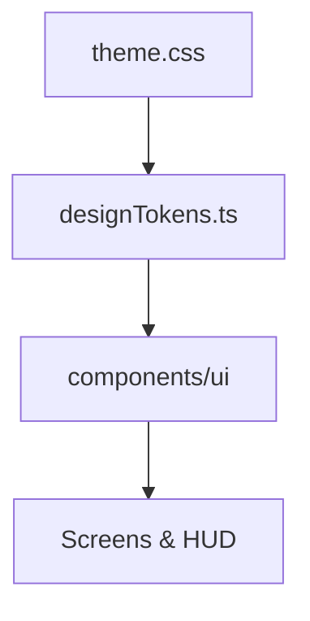

# Football 2027 Design System

Dark glass / broadcast sports UI. **Player = emerald**, **opponent = red**, **action = blue**, **warning = amber**.

## Tokens

| Layer | Path |
|-------|------|
| CSS `@theme` | `src/styles/theme.css` |
| Helpers | `src/ui/designTokens.ts` (`GLASS`, `ACCENT`, `TYPO`, `iconProps`) |
| Motion | `src/ui/motionPresets.ts` |

Icons: `iconProps('xs'|'sm'|'md'|'lg')` → stroke **1.75**, sizes **12/16/20/24**.

## Components (`src/components/ui/`)

- `GlassPanel` — hud | elevated | overlay
- `Panel` — animated menu card
- `Button` / `PrimaryButton` / `SecondaryButton`
- `Badge`, `Chip`, `SectionTitle`, `Divider`
- `ControlGlyph` — device-aware pills (`src/components/ControlGlyph.tsx`)

**Glass** for HUD/modals; **bg-surface** for full screens + `MenuBackdrop`.

## Usage map

Menus: Splash, MainMenu, QuickMatch, Career · Gameplay: HUD, MatchPhaseOverlay, SettingsOverlay, TouchControls.

